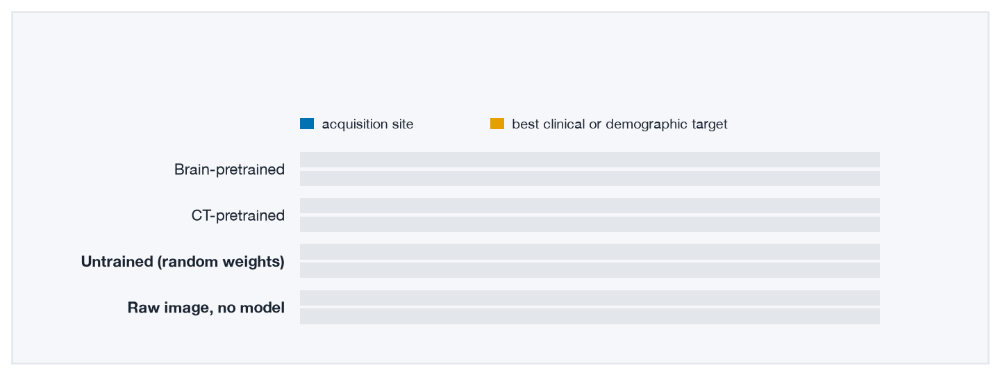
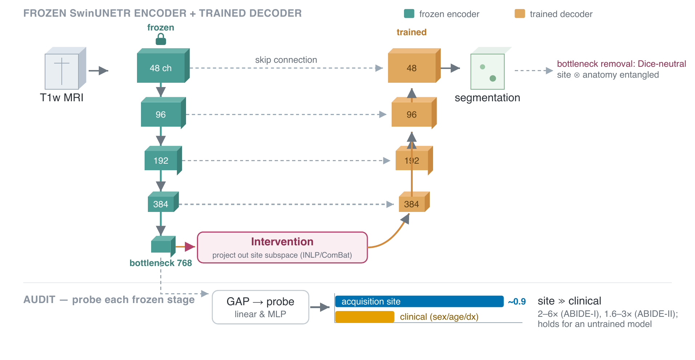
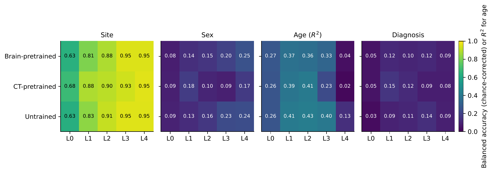
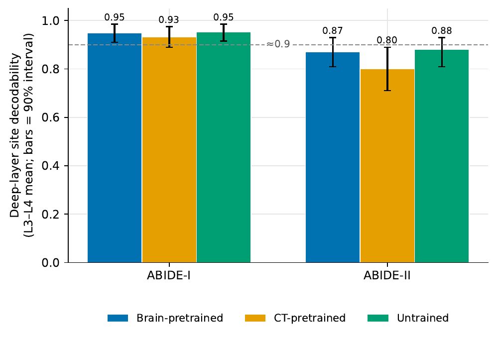
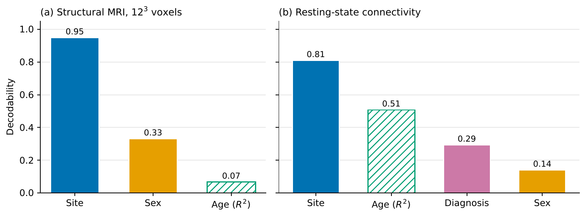

<p align="center">
  
</p>

<h1 align="center">Site Is Decodable Before Pretraining</h1>

<p align="center">
  <b>Negative controls for probing frozen brain-MRI foundation models</b><br>
  Code, results and figures for the paper
</p>

<p align="center">
  <a href="https://arxiv.org/abs/2608.10295"></a>
  <a href="https://doi.org/10.5281/zenodo.21753739"></a>
  <a href="https://github.com/saman-rahbar/scanner-fingerprints/actions/workflows/tests.yml"></a>
  
  <a href="LICENSE"></a>
</p>

<p align="center">
  <a href="#the-short-version">Overview</a> ·
  <a href="#quick-start">Quick start</a> ·
  <a href="#reproduce-the-paper">Reproduce</a> ·
  <a href="#data-and-models">Data</a> ·
  <a href="#citation">Citation</a>
</p>

---

## The short version

Brain foundation models are usually judged with a probe: freeze the model, train
a simple classifier on its output, and read the accuracy as a sign of what
pretraining learned. We show that this can mislead unless two controls are
reported alongside it.

We probed three frozen 3-D brain-MRI models on two independent multi-site
cohorts. The scanning site could be predicted from their output at about 0.9,
far above any clinical target. An **untrained** copy of the same model did just
as well. The **raw image**, shrunk to 12 × 12 × 12 voxels with no model at all,
reached 0.95. Pretraining did not create the site signal. It was already in the
scans.

The fix is cheap. Report every probe next to the same probe on an untrained
model and on the raw input. This repository contains both controls, ready to
run.

## Key numbers

| What was measured | Score |
|---|:---:|
| Site from the brain-pretrained model (ABIDE-I, last layer) | 0.948 |
| Site from an untrained copy of the same model | **0.956** |
| Site from the raw image, no model | **0.95** |
| Best clinical or demographic target, any layer (ABIDE-I) | 0.41 |
| Pretraining ahead of the untrained model by 0.05 or more, 50 splits | 1 of 30 cells |
| Same search on a single split | 5 of 30 cells |
| Site from resting-state fMRI connectivity | 0.81 |

Scores for site, sex and diagnosis are balanced accuracy corrected for chance:
0 is guessing and 1 is perfect. Age is reported as R².

## How the audit works

<p align="center">
  
</p>

Each frozen stage of the model is averaged over space and probed for the
scanning site and for each clinical or demographic target. The same probes then
run on an untrained model and on the raw image. A final experiment removes the
site directions from the frozen output and measures what that costs for
segmentation.

## What the controls show

<p align="center">
  
</p>

<table>
  <tr>
    <td width="45%"></td>
    <td width="55%"></td>
  </tr>
  <tr>
    <td><sub>An untrained model predicts site as well as the pretrained ones, on both cohorts.</sub></td>
    <td><sub>Inputs with no trained model already carry the site signal, for structural MRI and for fMRI.</sub></td>
  </tr>
</table>

## Quick start

```bash
git clone https://github.com/saman-rahbar/scanner-fingerprints.git
cd scanner-fingerprints
python -m venv .venv && source .venv/bin/activate
pip install -r requirements.txt

make test      # 12 self-tests on synthetic data: no downloads, no GPU, a few minutes
make figures   # rebuilds the paper's figures from the scores in results/
make control   # the search for a pretraining advantage, 50 splits against one split
```

Every analysis script has a `--sandbox` mode that runs on synthetic data, so you
can check the whole method before downloading anything. Scripts stop with a
clear error if data or model files are missing; they never fill in defaults.

## Reproduce the paper

Each step reads and writes plain files, so you can run them one at a time. Set
the data location once:

```bash
export ABIDE_ROOT=/path/to/abide      # T1 scans and the phenotype table
```

| Paper | What it does | Command |
|---|---|---|
| Sec. 4.1, Tables 1 and 2 | Model outputs at all five stages, for one model | `FROZEN_CKPT=brain.pt MULTILAYER_NPZ=out/multilayer_brain.npz python src/extract_multilayer.py` |
| | The untrained model: leave `FROZEN_CKPT` unset | `MULTILAYER_NPZ=out/multilayer_random.npz python src/extract_multilayer.py` |
| Sec. 4.1, Fig. 2 | Site and clinical scores over 50 splits, linear and neural-network probes | `GLOB="out/multilayer_*.npz" python src/scanner_dominance_ci.py` |
| Sec. 4.2 | Untrained against pretrained: paired test and equivalence test | `GLOB="out/multilayer_*.npz" python src/intrinsic_equivalence.py` |
| Sec. 4.2, Table 3 | Untrained ViT and ResNet | `ARCH=vit MULTILAYER_NPZ=out/multilayer_vit.npz python src/extract_multilayer.py` |
| Sec. 4.2, Table 4 | Three seeds per architecture | `python src/multiseed_intrinsic.py` |
| Sec. 4.3 | Site from the raw image, no model | `python src/raw_voxel_baseline.py` |
| Sec. 4.4 | Search for a pretraining advantage | `python src/positive_control.py results/abide1_dominance_50splits_1p0mm.json` |
| Sec. 4.5 | Remove age, sex and diagnosis, then measure site again | `GLOB="out/multilayer_*.npz" python src/population_adjust.py` |
| Sec. 4.7, Table 5 | Higher resolution (1.0 mm, 160³) | `SPACING_MM=1.0 IMG_SIZE=160 MULTILAYER_NPZ=... python src/extract_multilayer.py` |
| Sec. 4.8, Table 6 | Resting-state fMRI: raw connectivity and untrained models | `python src/fmri_arm.py --abide-root $ABIDE_ROOT --out-dir out` then `GLOB="out/multilayer_fmri-*.npz" python src/scanner_dominance.py` |
| Sec. 4.9 | Site removal (INLP and ComBat) for single-label prediction | `COHORT_NPZ=out/cohort.npz python src/global_readout.py` |
| Sec. 4.9, Table 7 | Site removal inside a segmentation network | `python src/segdice_intervention.py` and `python src/segdice_wherebites.py` |
| Figures | All paper figures | `make figures` |

Each script lists its settings, with defaults, at the top of the file.

Segmentation labels come from SynthSeg (`src/make_silver_labels.py`), which
ships with FreeSurfer 7.3 or later.

## Data and models

All data are public.

- **ABIDE-I** and **ABIDE-II** T1-weighted MRI from the FCP-INDI mirror
  (`s3://fcp-indi/data/Projects/ABIDE/` and `.../ABIDE2/`), which needs no
  account. The ABIDE-I phenotype table is in the same mirror; the ABIDE-II table
  comes from the ABIDE pages on NITRC. `slurm/fetch_abide2.sh` downloads ABIDE-II.
- **Resting-state fMRI**: the preprocessed ABIDE region time series (CC200),
  which `src/fmri_arm.py` downloads itself.

| Model | Source |
|---|---|
| Brain-pretrained SwinUNETR | BrainSegFounder, self-supervised on about 41,000 UK Biobank scans |
| CT-pretrained SwinUNETR | MONAI self-supervised SwinUNETR |
| Untrained | Same architecture, random weights from seeds 0, 1 and 2 |

Point `FROZEN_CKPT` at a checkpoint, or leave it unset for the untrained model.

## Running on a cluster

`slurm/` has one job script per step. Replace `YOUR_ACCOUNT`, the module lines
and the environment path with your own. Compute nodes without internet access
need the data and checkpoints downloaded on a login node first.

## Repository layout

```
src/
  extract_multilayer.py     model outputs at all five stages, for one model
  scanner_dominance_ci.py   site and clinical scores with intervals, linear and neural-network probes
  scanner_dominance.py      the same on a single split
  intrinsic_equivalence.py  untrained against pretrained: paired and equivalence tests
  arch_encoders.py          untrained ViT and ResNet models
  multiseed_intrinsic.py    three seeds per architecture
  raw_voxel_baseline.py     probes on the raw image, no model
  positive_control.py       search for a pretraining advantage
  population_adjust.py      remove age, sex and diagnosis, then measure site
  fmri_arm.py               resting-state fMRI: raw connectivity and untrained models
  confound_audit.py         shared probes, INLP and projection
  combat_baseline.py        ComBat, and INLP against ComBat
  global_readout.py         site removal for single-label prediction across sites
  segdice_intervention.py   site removal inside a segmentation network
  segdice_wherebites.py     few-site training, all-scale removal, random-direction control
  build_cohort.py           ABIDE scans to model outputs
  make_silver_labels.py     SynthSeg labels
  make_figures.py           paper figures 3 and 4
  make_figures_v2.py        paper figures 2 and 5, from results/
results/                    the scores behind the figures and tables
assets/                     images used in this README
slurm/                      example cluster jobs
tools/make_hero.py          the animation at the top of this page
```

## Citation

If you use this code or build on the paper, please cite:

```bibtex
@article{rahbar2026site,
  title   = {Site Is Decodable Before Pretraining: Negative Controls for Probing
             Frozen Brain-MRI Foundation Models},
  author  = {Rahbar, Saman},
  journal = {arXiv preprint arXiv:2608.10295},
  year    = {2026}
}
```

The code itself is archived on Zenodo:
[10.5281/zenodo.21753739](https://doi.org/10.5281/zenodo.21753739).

## License

MIT. See [LICENSE](LICENSE). ABIDE data are subject to the ABIDE data use terms.
